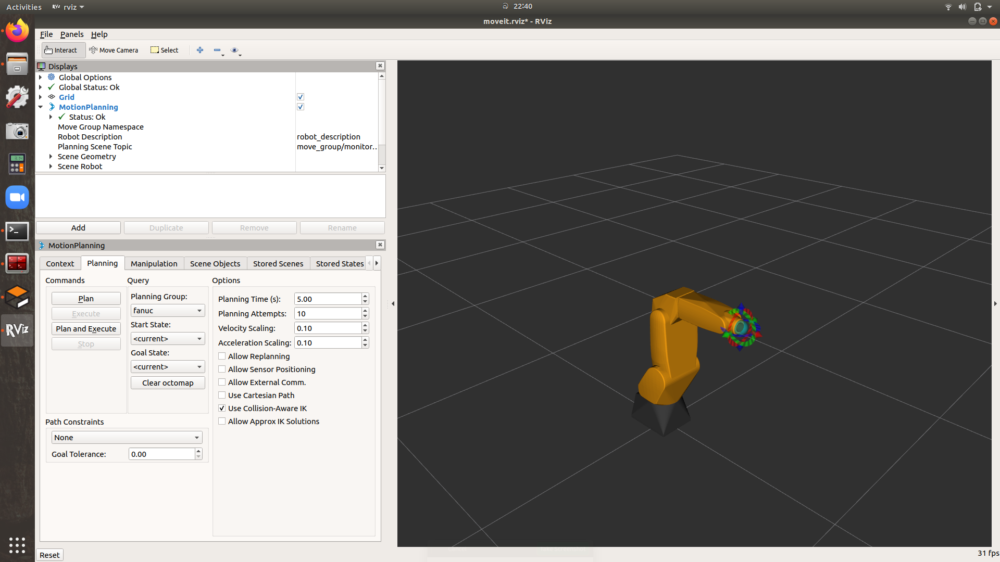
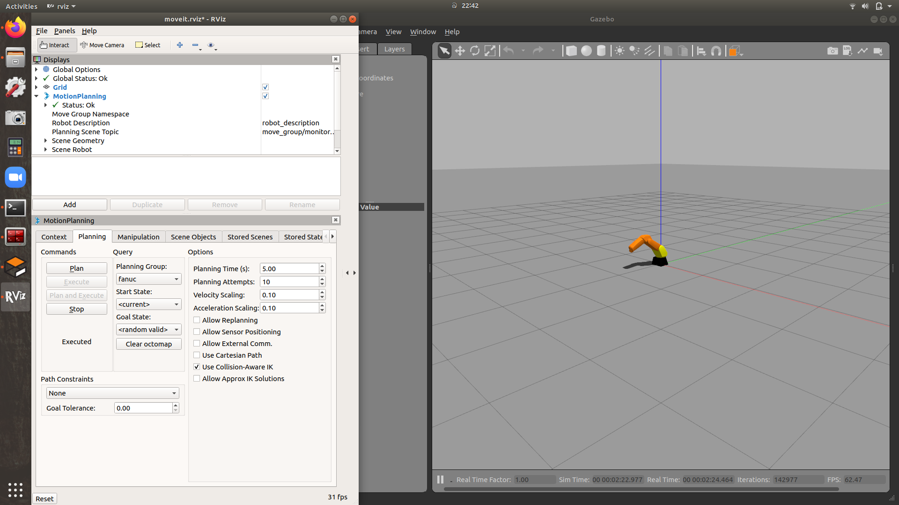
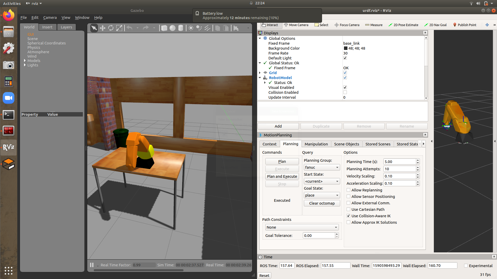
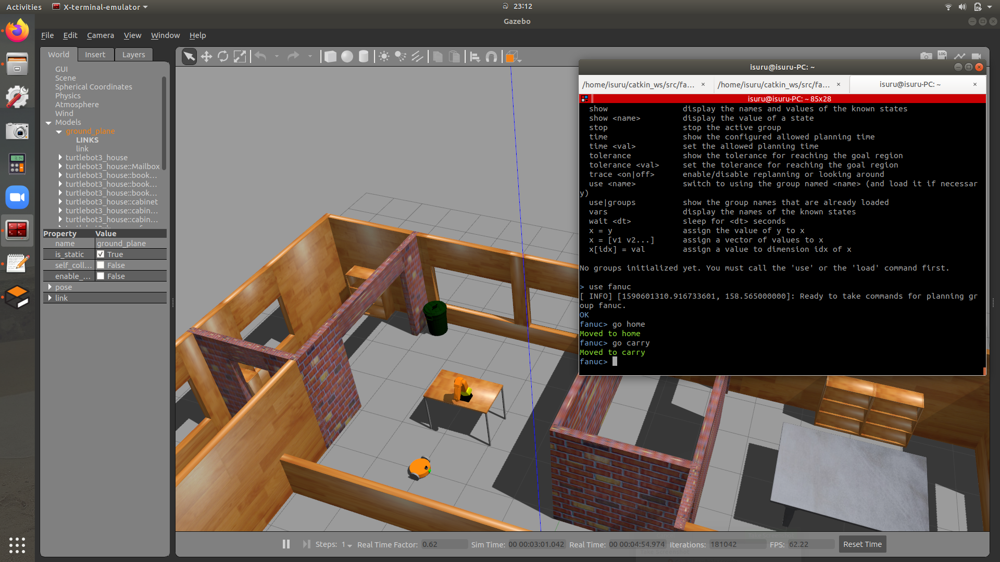

# MoveIt config files for Fanuc 200ic robot

This is the MoveIt config files for the package [fanuc_at_home](https://github.com/IsuruKalhara/ros_fanuc_at_home). In fanuc_at_home package I made two launch files fanuc_on_table.launch and fanuc_and_base.launch. 
To start MoveIt with fanuc_on_table use move_group.launch and to start MoveIt with fanuc_and_base.launch use move_group_with_base.launch. The latter one is configured to work with 'arm' namespace.

Using this package you can learn how to set up move_group to run with multiple robot spawned environments(namespaced robots). 

If you want to directly run this package without fanuc_at_home package, use demo_gazebo.launch or demo.launch. 

### MoveIt RViz control

### MoveIt RViz + Gazebo control
 

### MoveIt commander 

